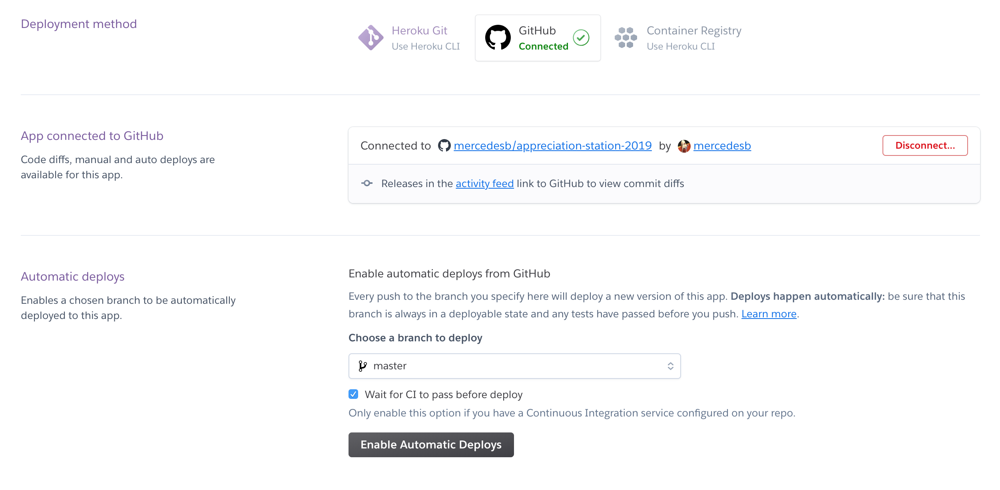

# Heroku Deployment

## What is Heroku?

Heroku is a cloud platform as a service (PaaS). It makes the infrastructure part of an application easier so you can worry about the code. They have [great documentation](https://devcenter.heroku.com/start) to follow to get started.

## Create a Heroku App
An app is the fundamental unit of organization on Heroku. You can kind of think of an app like a single environment of a single project. (e.g. the production Dev Together app)

Heroku app names must be unique. To [create a Heroku app](https://devcenter.heroku.com/articles/creating-apps
) with a random name, run the following command
```
heroku create
```

To create an app with a specific name
```
heroku create APP_NAME
```

When you create an app, a git remote (called `heroku`) is also created and associated with your local git repository.

## Manually deploy your Heroku app
To deploy, you want to push your source code to the `heroku` git remote.
```
git push heroku master
```

When the deploy is done, visit the app at the URL generated by its app name. This shortcut also opens it
```
heroku open
```

🎉🎉🎉

## Setting up automatic deploys and continuous integration
We want to make sure our tests pass before a deploy runs. If we introduce a bug and break tests, we don't want to deploy that code.

Open your app in the Heroku UI. 

Go to the Deploy tab.

Choose Connect to GitHub for the Deployment method.

Search for your forked appreciation-station-2019 project and click 'Connect'.

Under Automatic deploys, choose the branch you want to deploy (we'll leave it as master).

Click the checkbox 'Wait for CI to pass before deploy.' This will run all your tests and require that your tests pass before it will deploy. If your tests fail, the deploy won't run.



## Heroku Pipelines

// TODO: if time